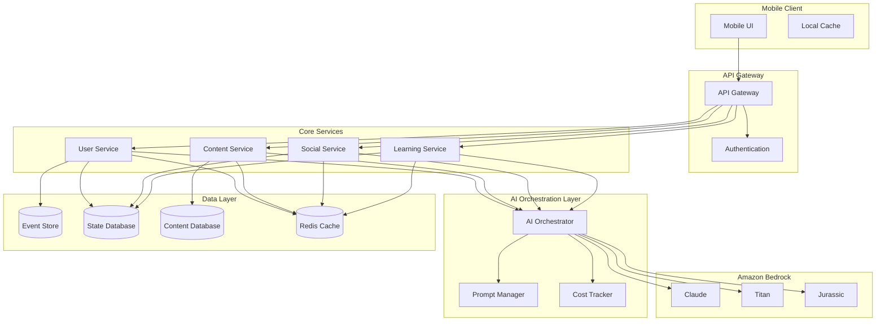

# Design Document: AI Learning OS

## Overview

The AI Learning OS is a mobile-first learning platform that uses AI as a reasoning and guidance layer to help learners understand their progress, discover relevant content, and connect with appropriate peers. The system architecture separates concerns between raw memory storage, derived state computation, and AI-powered reasoning to ensure cost efficiency, explainability, and reliability.

The platform centers around five core experiences: a reflective learning feed with masked posts, automatic learning level inference, synergy-based social interactions, visual learning journey mapping, and a personal AI assistant. All AI operations are bounded by verified learning paths and use Amazon Bedrock for managed GenAI capabilities.

## Architecture

### High-Level System Architecture



### Mobile-First Architecture Principles

The system follows a mobile-first approach with these key principles:

1. **Backend State Ownership**: All critical state and memory reside in backend services, not on mobile devices
2. **Optimistic UI Updates**: Mobile clients can update UI optimistically while syncing with backend
3. **Efficient Data Transfer**: APIs return minimal, structured data optimized for mobile consumption
4. **Offline Resilience**: Core reading functionality works offline with cached data
5. **Battery Optimization**: AI processing happens server-side to preserve mobile battery life

## Components and Interfaces

### Core Services

#### User Service
Manages user profiles, learning levels, and activity tracking.

**Key Interfaces:**
- `POST /users/{userId}/activities` - Record learning activity
- `GET /users/{userId}/level` - Get current learning level
- `GET /users/{userId}/status` - Get learning status for AI assistant

#### Content Service
Handles learning posts, article tagging, and content filtering. Posts are automatically generated when users complete to-do tasks.

**Key Interfaces:**
- `POST /todos/{todoId}/complete` - Complete to-do and auto-generate learning post with AI masking
- `GET /posts/feed` - Get level-filtered learning feed
- `POST /articles/tag` - Tag articles with AI analysis
- `GET /articles/feed` - Get level-aware news feed

#### Social Service
Manages synergy calculations and chat unlocking.

**Key Interfaces:**
- `POST /interactions` - Record user interactions for synergy
- `GET /users/{userId}/synergy` - Get synergy scores with other users
- `POST /chats` - Create chat when synergy threshold met
- `GET /chats/{chatId}/messages` - Get chat messages

#### Learning Service
Provides learning journey visualization and path management.

**Key Interfaces:**
- `GET /journey/{userId}` - Get personalized learning journey mindmap
- `GET /paths` - Get available verified learning paths
- `POST /progress` - Update learning progress

### AI Orchestration Layer

#### AI Orchestrator
Central service that manages all AI operations with cost tracking and prompt optimization.

**Key Responsibilities:**
- Route AI requests to appropriate Bedrock models
- Implement cost-aware batching and caching
- Ensure AI suggestions stay within verified learning paths
- Provide explainable AI decision logging

**Key Interfaces:**
- `POST /ai/summarize` - Generate post masks and summaries
- `POST /ai/analyze-level` - Infer learning level from activity
- `POST /ai/tag-content` - Tag articles for level-aware filtering
- `POST /ai/generate-todos` - Create personalized to-dos and reminders

#### Prompt Manager
Manages prompt templates and optimization strategies.

**Key Features:**
- Template-based prompt generation
- A/B testing for prompt effectiveness
- Context-aware prompt selection
- Prompt versioning and rollback

#### Cost Tracker
Monitors AI usage costs and implements cost controls.

**Key Features:**
- Real-time cost monitoring per user/operation
- Cost budgets and alerts
- Usage pattern analysis
- Cost optimization recommendations

## Data Models

### User Data Model

```typescript
interface User {
  id: string;
  profile: UserProfile;
  learningLevel: number;
  currentPath: string[];
  activityHistory: LearningActivity[];
  preferences: UserPreferences;
  createdAt: Date;
  updatedAt: Date;
}

interface LearningActivity {
  id: string;
  userId: string;
  type: 'post' | 'interaction' | 'completion' | 'assessment';
  content: any;
  timestamp: Date;
  levelIndicators: LevelIndicator[];
}

interface LevelIndicator {
  skill: string;
  competencySignal: number;
  confidence: number;
}
```

### Content Data Model

```typescript
interface LearningPost {
  id: string;
  userId: string;
  originalContent: string;
  aiMask: string;
  tags: string[];
  learningLevel: number;
  interactions: PostInteraction[];
  sourceType: 'todo_completion' | 'manual';
  sourceTodoId?: string;
  createdAt: Date;
}

interface Article {
  id: string;
  title: string;
  content: string;
  url: string;
  aiTags: ContentTag[];
  targetLevels: number[];
  taggedAt: Date;
}

interface ContentTag {
  category: string;
  relevanceScore: number;
  requiredLevel: number;
  concepts: string[];
}
```

### Social Data Model

```typescript
interface SynergyScore {
  userA: string;
  userB: string;
  score: number;
  interactions: SynergyInteraction[];
  chatUnlocked: boolean;
  lastUpdated: Date;
}

interface SynergyInteraction {
  type: 'like' | 'comment' | 'share' | 'scratch_reveal';
  timestamp: Date;
  contentId: string;
  weight: number;
}

interface Chat {
  id: string;
  participants: string[];
  synergyRequired: number;
  messages: ChatMessage[];
  createdAt: Date;
}
```

### Learning Journey Data Model

```typescript
interface LearningJourney {
  userId: string;
  currentLevel: number;
  unlockedNodes: JourneyNode[];
  completedMilestones: string[];
  suggestedNext: string[];
  pathHistory: PathStep[];
}

interface JourneyNode {
  id: string;
  type: 'concept' | 'skill' | 'milestone';
  title: string;
  description: string;
  requiredLevel: number;
  dependencies: string[];
  position: { x: number; y: number };
}

interface VerifiedLearningPath {
  id: string;
  name: string;
  description: string;
  nodes: JourneyNode[];
  progressionRules: ProgressionRule[];
  estimatedDuration: number;
}
```

## Memory and State Design

### Event Sourcing for Learning Activities

The system uses event sourcing to capture all learning activities as immutable events, enabling accurate learning level inference and audit trails.

**Event Store Structure:**
- Raw learning events (posts, interactions, completions)
- Immutable and append-only
- Enables replay for level recalculation
- Supports analytics and debugging

**State Derivation:**
- Learning levels computed from event history
- Synergy scores calculated from interaction events
- Journey progress derived from completion events
- AI insights generated from aggregated patterns

### Caching Strategy

**Multi-Level Caching:**
1. **Mobile Client Cache**: Recently viewed content and user state
2. **API Gateway Cache**: Frequently requested data with short TTL
3. **Redis Cache**: Computed states like learning levels and synergy scores
4. **AI Response Cache**: Expensive AI operations cached for reuse

**Cache Invalidation:**
- Event-driven invalidation for user state changes
- Time-based expiration for AI-generated content
- Manual invalidation for critical updates

## AI Orchestration Layer

### AI Usage Boundaries

**Appropriate AI Usage:**
- **Summarization**: Generate post masks and content summaries
- **Extraction**: Extract learning signals from user activities
- **Reasoning**: Infer learning levels and suggest next steps
- **Synthesis**: Create personalized to-dos and learning recommendations

**Prohibited AI Usage:**
- **Memory Storage**: AI models must not store user data or state
- **Business Rules**: Core logic implemented in traditional code
- **Permissions**: Access control handled by backend services
- **Feed Sorting**: Algorithmic sorting based on explicit rules

### Prompt Strategy

**Template-Based Approach:**
- Standardized prompt templates for each AI operation
- Context injection with user-specific data
- Consistent output formatting requirements
- Version control for prompt evolution

**Example Prompt Templates:**

```
POST_MASK_TEMPLATE = """
Summarize this learning post in 1-2 sentences that capture the key learning activity without revealing specific details:

Original Post: {original_content}
User Level: {user_level}
Learning Path: {current_path}

Requirements:
- Keep summary engaging but vague
- Maintain learning context
- Use encouraging tone
- Maximum 50 words
"""

LEVEL_INFERENCE_TEMPLATE = """
Analyze these learning activities to infer current competency level:

Activities: {recent_activities}
Current Level: {current_level}
Path Context: {learning_path}

Provide:
- Numeric level (0-100)
- Confidence score (0-1)
- Key competency indicators
- Reasoning explanation
"""
```

### Real-time vs Batch AI Usage

**Real-time AI Operations:**
- Post masking (immediate user feedback required)
- AI assistant responses (conversational context)
- Critical learning level updates (affects content filtering)

**Batch AI Operations:**
- Article tagging (can be processed offline)
- Learning level recalculation (daily batch job)
- Synergy score updates (hourly batch processing)
- Analytics and insights generation (weekly batch)

**Cost Optimization Strategies:**
- Batch similar requests together
- Cache AI responses aggressively
- Use cheaper models for simple tasks
- Implement request deduplication
- Monitor and alert on cost thresholds

## Error Handling

### AI Service Failures

**Graceful Degradation:**
- Post masking failure: Show original content with warning
- Level inference failure: Use last known level
- Content tagging failure: Use manual tags or skip filtering
- Assistant failure: Show cached responses or disable feature

**Retry Strategies:**
- Exponential backoff for transient failures
- Circuit breaker pattern for persistent failures
- Fallback to simpler AI models when primary fails
- Queue failed requests for later processing

### Data Consistency

**Event Store Reliability:**
- Duplicate event detection and deduplication
- Event ordering guarantees within user streams
- Backup and recovery procedures
- Cross-region replication for disaster recovery

**State Synchronization:**
- Eventual consistency between event store and derived state
- Conflict resolution for concurrent updates
- State reconstruction from events when needed
- Monitoring for state drift and correction

## Testing Strategy

The AI Learning OS requires comprehensive testing across multiple dimensions: functional correctness, AI behavior validation, performance under load, and cost efficiency. The testing approach combines traditional unit and integration testing with specialized property-based testing for AI components and user behavior patterns.

**Dual Testing Approach:**
- **Unit tests**: Verify specific examples, edge cases, and error conditions for individual components
- **Property tests**: Verify universal properties across all inputs, especially for AI-driven features and user interactions
- Both approaches are complementary and necessary for comprehensive coverage

**Unit Testing Focus:**
- API endpoint behavior and error handling
- Data model validation and serialization
- Authentication and authorization logic
- Cache invalidation and consistency
- AI service integration points

**Property Testing Focus:**
- Learning level inference consistency across different activity patterns
- Content filtering accuracy across user levels and paths
- Synergy calculation fairness and symmetry
- AI response quality and safety boundaries
- Cost efficiency across usage patterns

**AI-Specific Testing:**
- Prompt template effectiveness measurement
- AI response quality scoring and regression detection
- Cost tracking accuracy and budget enforcement
- Fallback behavior when AI services fail
- Bias detection in learning level inference and content recommendations

**Property Test Configuration:**
- Minimum 100 iterations per property test due to randomization
- Each property test references its corresponding design document property
- Tag format: **Feature: ai-learning-os, Property {number}: {property_text}**
- Use property-based testing library appropriate for the implementation language
- Focus on universal correctness properties rather than specific examples

## Correctness Properties

*A property is a characteristic or behavior that should hold true across all valid executions of a system—essentially, a formal statement about what the system should do. Properties serve as the bridge between human-readable specifications and machine-verifiable correctness guarantees.*

Based on the prework analysis of acceptance criteria, the following properties ensure the AI Learning OS behaves correctly across all inputs and scenarios:

### Content Management Properties

**Property 1: Post masking completeness**
*For any* to-do task completed by a user, the system should automatically generate a learning post with both original content and an AI summary mask
**Validates: Requirements 1.1**

**Property 2: Feed display consistency**
*For any* learning feed request, all displayed posts should show AI-generated masks initially, never original content
**Validates: Requirements 1.2**

**Property 3: Content reveal interaction**
*For any* masked post in the feed, user interaction should reveal the original content through scratch-to-reveal mechanism
**Validates: Requirements 1.3**

**Property 4: Level-based feed filtering**
*For any* user requesting their learning feed, all returned posts should be from users within the same learning level range
**Validates: Requirements 1.4**

### Learning Level Properties

**Property 5: Activity-based level derivation**
*For any* set of learning activities performed by a user, the system should analyze the data and derive a numeric learning level
**Validates: Requirements 2.1, 2.2**

**Property 6: Verified data usage**
*For any* learning level calculation, only verified learning activity data should influence the resulting level
**Validates: Requirements 2.3**

**Property 7: Level update responsiveness**
*For any* new learning activity added to a user's history, the learning level should be updated to reflect the new data
**Validates: Requirements 2.4**

**Property 8: Level immutability from user input**
*For any* attempt by a user to manually set or override their learning level, the system should reject the change and maintain the derived level
**Validates: Requirements 2.5**

### Social Interaction Properties

**Property 9: Synergy score calculation**
*For any* two users at similar learning levels who engage with each other's content, their mutual synergy score should increase
**Validates: Requirements 3.1**

**Property 10: Chat unlock threshold**
*For any* pair of users, chat functionality should be unlocked if and only if their synergy score meets or exceeds the threshold
**Validates: Requirements 3.2**

**Property 11: Mutual engagement requirement**
*For any* synergy calculation between two users, only mutual engagement activities should contribute to the score
**Validates: Requirements 3.4**

### Learning Journey Properties

**Property 12: Mindmap structure consistency**
*For any* learning journey display, the content should be structured as a visual mindmap containing concepts, skills, and milestones
**Validates: Requirements 4.1**

**Property 13: Level-based journey filtering**
*For any* user's learning journey view, only content up to their current learning level should be visible
**Validates: Requirements 4.2**

**Property 14: Dynamic content unlocking**
*For any* user whose learning level increases, additional mindmap sections should become available in their journey view
**Validates: Requirements 4.3**

**Property 15: Current position highlighting**
*For any* learning journey display, the user's current position should be clearly highlighted within the mindmap
**Validates: Requirements 4.4**

**Property 16: Verified path recommendations**
*For any* next step recommendations shown to a user, all suggestions should be based on verified learning paths appropriate for their current position
**Validates: Requirements 4.5**

### AI Assistant Properties

**Property 17: Status-aware greeting**
*For any* application opening by a user, the AI assistant should greet them with current learning status information
**Validates: Requirements 5.1**

**Property 18: Activity-based todo generation**
*For any* user's learning activity history, the AI assistant should generate personalized to-dos and reminders based on that activity
**Validates: Requirements 5.2**

**Property 19: Voice interaction support**
*For any* user with voice interaction enabled, the AI assistant should support and respond to voice-based communication
**Validates: Requirements 5.4**

### Content Filtering Properties

**Property 20: Article tagging consistency**
*For any* article added to the system, it should receive AI-generated tags through analysis
**Validates: Requirements 6.1**

**Property 21: Level-aware article filtering**
*For any* user's news feed request, returned articles should be filtered based on their learning path and current level
**Validates: Requirements 6.2**

**Property 22: Dynamic article filtering**
*For any* user whose learning level changes, their news feed article filtering should adjust to reflect the new level
**Validates: Requirements 6.4**

**Property 23: Single article tagging**
*For any* article in the system, it should be tagged exactly once using AI analysis to maintain cost efficiency
**Validates: Requirements 6.5**

### AI Orchestration Properties

**Property 24: AI operation boundaries**
*For any* AI operation performed by the system, it should be limited to summarization, extraction, reasoning, or synthesis only
**Validates: Requirements 7.2**

**Property 25: Backend state ownership**
*For any* system memory or state data, it should be stored in backend systems rather than in AI models
**Validates: Requirements 7.3**

**Property 26: Traditional business logic**
*For any* business rule or permission check, it should be implemented through traditional logic rather than AI decisions
**Validates: Requirements 7.4**

**Property 27: Path-bounded AI suggestions**
*For any* AI-generated suggestion or recommendation, it should reference only verified learning paths
**Validates: Requirements 7.5**

**Property 28: Scroll operation efficiency**
*For any* user scroll operation in the application, no AI calls should be triggered to maintain cost efficiency
**Validates: Requirements 7.6**

**Property 29: AI decision explainability**
*For any* AI-driven decision made by the system, it should include explainable reasoning for the decision
**Validates: Requirements 5.3, 7.7**

### Architecture Properties

**Property 30: Backend state management**
*For any* critical system state or memory, it should be owned and managed by backend services rather than client applications
**Validates: Requirements 8.2**

**Property 31: Data layer separation**
*For any* system data, raw memory events should be clearly separated from derived state and AI reasoning
**Validates: Requirements 8.3**

### Security Properties

**Property 32: Data encryption consistency**
*For any* user learning data, it should be encrypted both in transit and at rest
**Validates: Requirements 9.1**

**Property 33: Access control enforcement**
*For any* user data access request, appropriate access controls should be enforced to prevent unauthorized access
**Validates: Requirements 9.2**

**Property 34: Data sharing preference compliance**
*For any* user's data sharing preferences, the system should respect and enforce those preferences in all data sharing operations
**Validates: Requirements 9.4**

**Property 35: AI safety boundaries**
*For any* AI-generated output, it should be filtered and bounded to prevent misuse and ensure responsible AI behavior
**Validates: Requirements 9.5**

### Performance Properties

**Property 36: Cost-aware AI usage**
*For any* AI operation, the system should track costs and ensure usage stays within defined cost budgets and patterns
**Validates: Requirements 10.4**

**Property 37: Graceful AI degradation**
*For any* scenario where AI services are unavailable, the system should continue functioning with graceful degradation rather than complete failure
**Validates: Requirements 10.5**